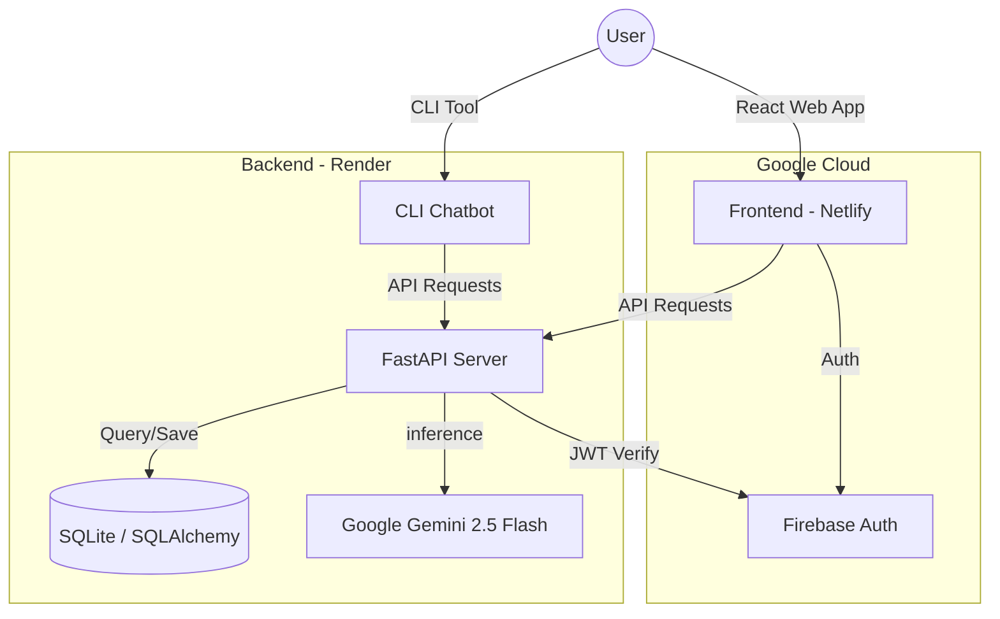

# 🗳️ NEIC - National Election Information Companion

## 🌟 Project Overview
**NEIC (National Election Information Companion)** is an advanced AI-powered educational platform designed to empower Indian citizens with accurate, non-partisan information about the democratic process. Developed for the **Google Prompt-War**, NEIC simplifies complex election procedures into an interactive, multi-lingual experience.

## 🎯 Purpose
To bridge the information gap in the Indian electoral process by providing:
- Real-time guidance on voter registration and booth procedures.
- Interactive AI assistance for election-related queries.
- Multi-language support (English, Hindi, Tamil) for inclusive accessibility.
- Step-by-step visual guides for EVM and VVPAT usage.

---

## 🛠️ Tech Stack

### Frontend

  
  
  
  
  

### Backend

  
  
  
  

### AI Core

  

---

## 🏗️ Project Architecture

---

## 🚀 Deployment

### Backend (Render)
1. **Blueprint**: Uses `render.yaml` for automated deployment.
2. **Environment**: Configured for Python 3.12 with Uvicorn.
3. **Security**: Firebase Service Account keys managed via Render Secret Files.

### Frontend (Netlify)
1. **SPA Routing**: Configured with `_redirects` to handle React Router paths.
2. **Security**: Implements `Cross-Origin-Opener-Policy` for secure Firebase popups.
3. **CI/CD**: Auto-deploys from the `main` branch.

---

## 🔗 Links & Socials

- **Live Platform**: [neic-project.netlify.app](https://neic-project.netlify.app/)
- **LinkedIn Post**: [View Project Post](https://www.linkedin.com/posts/shanmugaraj-r-644782290_google-promptwar-ai-activity-7302213793616683009-qj_l?utm_source=share&utm_medium=member_desktop)
- **Technical Blog**: [Read on Hashnode/Medium](#)
- **Instagram Showcase**: [Watch Demo Reel](#)

## 👨‍💻 Developer
**Shanmugaraj R**
- **LinkedIn**: [Shanmugaraj R](https://www.linkedin.com/in/shanmugaraj-r-644782290/)
- **GitHub**: [Shanmuga-Raj27](https://github.com/Shanmuga-Raj27)

---

> [!NOTE]
> This project is only for educational purposes and was fully developed using **Google Antigravity AI-assisted coding**. It demonstrates the power of agentic AI in building complex, secure, and accessible public-interest software.

---
© 2026 National Election Information Companion
